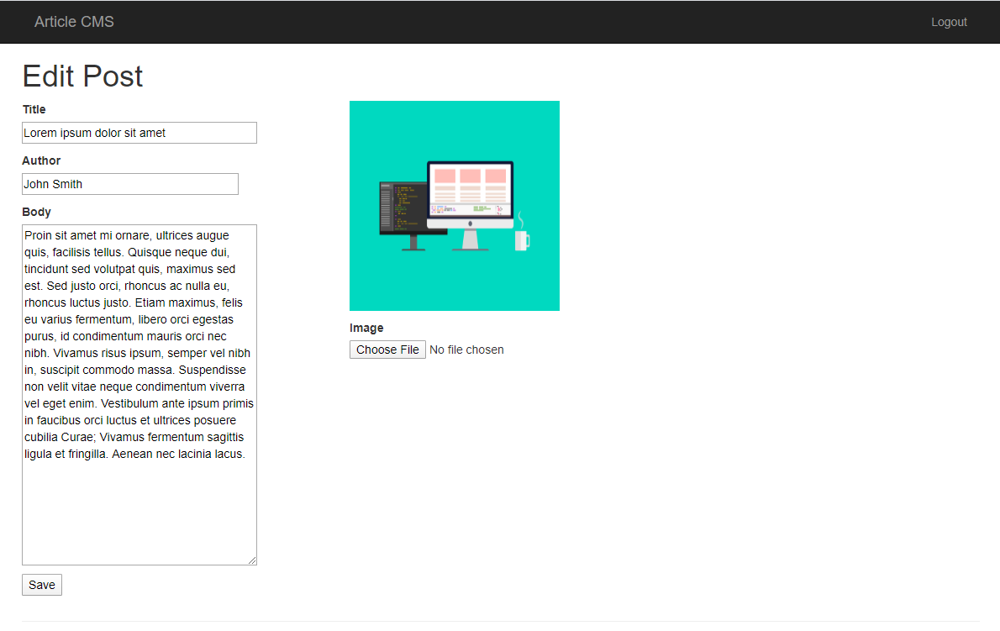

# Article CMS (Flask Web Application on Azure)

## Live Application

The Flask Article CMS application has been deployed on **Microsoft Azure App Service**.

**Live URL**

https://cms-shashank-f9edekbrdpbud9hc.centralus-01.azurewebsites.net

---

## Login Credentials

Use the following credentials to access the CMS dashboard.

Username: admin  
Password: pass  

### Article CMS Home Page

---

## Project Overview

This project demonstrates how to deploy a **Flask-based Content Management System (CMS)** on **Microsoft Azure**.

The CMS allows users to:

- Log in to the system
- Create new articles
- Edit existing articles
- Upload images for articles
- Store article data in **Azure SQL Database**
- Store images in **Azure Blob Storage**

The application integrates multiple Azure cloud services along with Flask to build a complete cloud-hosted web application.

---

## Azure Resources Used

The following Azure resources were created for this project:

- **Azure Resource Group** – organizes all project resources
- **Azure App Service** – hosts the Flask web application
- **Azure SQL Server** – manages the SQL database server
- **Azure SQL Database** – stores user and article data
- **Azure Storage Account** – provides blob storage service
- **Azure Blob Storage Container** – stores uploaded images
- **Azure Active Directory App Registration** – enables Microsoft authentication

These services work together to host and manage the application in the cloud.

---

## Deployment Method

The application was deployed using **Azure App Service** with **GitHub integration for continuous deployment**.

Deployment steps performed:

1. Created a **Resource Group** in Azure.
2. Created an **Azure SQL Server** and **SQL Database**.
3. Executed SQL scripts to populate the `users` and `articles` tables.
4. Created a **Storage Account** and **Blob Storage Container** to store article images.
5. Configured the Flask application to connect to **Azure SQL Database**.
6. Configured **Azure Blob Storage** for storing uploaded images.
7. Implemented **Microsoft authentication using the MSAL library**.
8. Deployed the application to **Azure App Service** using GitHub deployment.

---

## Continuous Deployment

Continuous deployment is configured using **GitHub Actions**.

Whenever changes are pushed to the GitHub repository:

1. GitHub builds the Flask application
2. Dependencies are installed using `requirements.txt`
3. The application is automatically deployed to Azure App Service

This allows automatic updates whenever the repository code changes.

---

## Screenshots

### Running Article CMS Application

The following screenshot shows the CMS application successfully running on Azure.

---

### Azure Resource Group

This screenshot shows all Azure resources created for this project.

---

### SQL Database Tables

This screenshot shows the `users` and `articles` tables populated with data in Azure SQL Database.

---

## Technologies Used

The project was built using the following technologies:

- Python
- Flask
- Flask-Login
- Flask-SQLAlchemy
- Azure App Service
- Azure SQL Database
- Azure Blob Storage
- Microsoft Authentication Library (MSAL)
- GitHub Actions (CI/CD)

---

## Conclusion

This project demonstrates how a **Flask web application can be deployed and integrated with Microsoft Azure cloud services**.

The system integrates:

- Web application development with Flask
- Cloud hosting with Azure App Service
- Database storage using Azure SQL Database
- Image storage using Azure Blob Storage
- Authentication using Microsoft Identity
- Automated deployment using GitHub Actions

This showcases a complete **cloud-based web application architecture** using Azure services.
