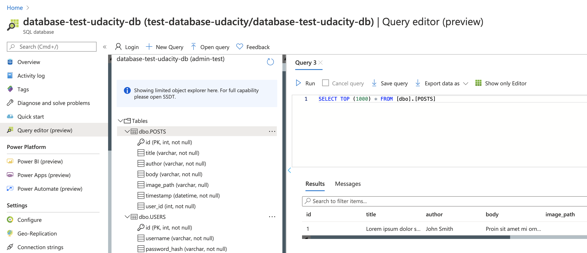
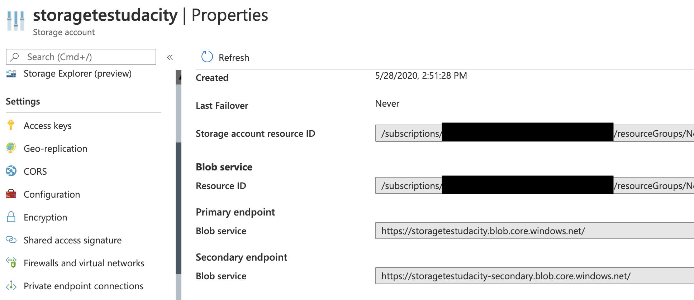
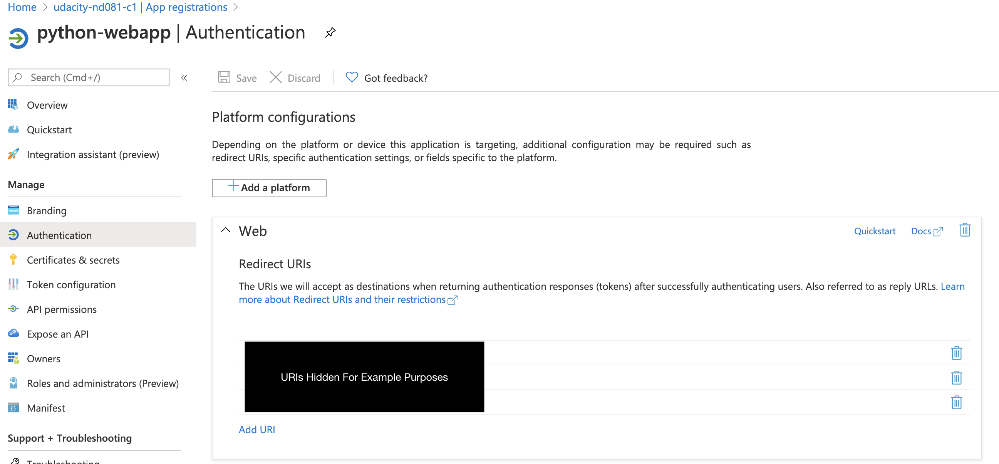
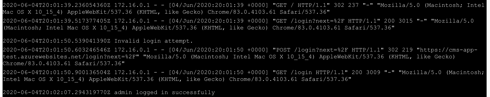
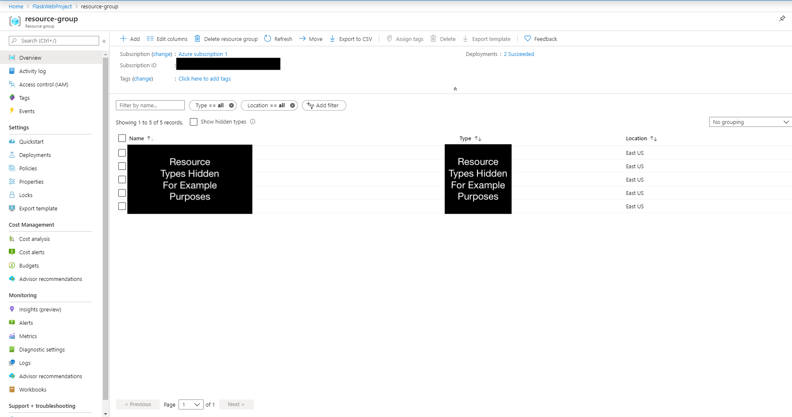

---

# Student Solution

## Live Application

The Flask Article CMS application has been deployed to Microsoft Azure App Service.

Live URL:

---

# Student Solution

## Live Application

The Flask Article CMS application has been deployed to Microsoft Azure App Service.

Live URL:

https://cms-shashank-f9edekbrdpbud9hc.centralus-01.azurewebsites.net

Login Credentials:

Username: admin  
Password: pass

---

## Azure Resources Used

The following resources were created in Azure to deploy the application:

- Azure Resource Group
- Azure App Service (Web App)
- Azure SQL Server
- Azure SQL Database
- Azure Storage Account
- Azure Blob Storage Container
- Azure Active Directory App Registration

---

## Deployment Method

The application was deployed using **Azure App Service**.

Steps used for deployment:

1. Created a Resource Group in Azure.
2. Created an Azure SQL Server and SQL Database.
3. Executed SQL scripts to populate the `users` and `articles` tables.
4. Created a Storage Account and Blob Container to store article images.
5. Configured the Flask application to connect to Azure SQL Database.
6. Configured Azure Blob Storage to store uploaded images.
7. Implemented Microsoft authentication using the `msal` library.
8. Deployed the application to Azure App Service using **GitHub Actions CI/CD pipeline**.

---

## Continuous Deployment

Continuous deployment was configured using **GitHub Actions**.

Whenever changes are pushed to the GitHub repository:

1. GitHub Actions builds the Flask project
2. Dependencies are installed using `requirements.txt`
3. The application is automatically deployed to Azure App Service

---

## Screenshots

### Running Article CMS Application

The following screenshot shows the application successfully running on Azure after creating a new article.

---

### Azure Resource Group

This screenshot shows all Azure resources created for this project.

---

### SQL Database Tables

This screenshot shows the `users` and `articles` tables populated with data.

---

### Azure Blob Storage

This screenshot shows the storage endpoint used for storing article images.

---

### Microsoft Authentication Redirect URIs

This screenshot shows the redirect URIs configured for Azure Active Directory authentication.

---

### Application Logs

This screenshot shows logging from the application, including both valid and invalid login attempts.

---

## Technologies Used

- Python
- Flask
- Flask-Login
- Flask-SQLAlchemy
- Azure App Service
- Azure SQL Database
- Azure Blob Storage
- Microsoft Authentication Library (MSAL)
- GitHub Actions (CI/CD)

---
Login Credentials:

Username: admin  
Password: pass

---

## Azure Resources Used

The following resources were created in Azure to deploy the application:

- Azure Resource Group
- Azure App Service (Web App)
- Azure SQL Server
- Azure SQL Database
- Azure Storage Account
- Azure Blob Storage Container
- Azure Active Directory App Registration

---

## Deployment Method

The application was deployed using **Azure App Service**.

Steps used for deployment:

1. Created a Resource Group in Azure.
2. Created an Azure SQL Server and SQL Database.
3. Executed SQL scripts to populate the `users` and `articles` tables.
4. Created a Storage Account and Blob Container to store article images.
5. Configured the Flask application to connect to Azure SQL Database.
6. Configured Azure Blob Storage to store uploaded images.
7. Implemented Microsoft authentication using the `msal` library.
8. Deployed the application to Azure App Service using **GitHub Actions CI/CD pipeline**.

---

## Continuous Deployment

Continuous deployment was configured using **GitHub Actions**.

Whenever changes are pushed to the GitHub repository:

1. GitHub Actions builds the Flask project
2. Dependencies are installed using `requirements.txt`
3. The application is automatically deployed to Azure App Service

---

## Screenshots

### Running Article CMS Application

The following screenshot shows the application successfully running on Azure after creating a new article.

---

### Azure Resource Group

This screenshot shows all Azure resources created for this project.

---

### SQL Database Tables

This screenshot shows the `users` and `articles` tables populated with data.

---

### Azure Blob Storage

This screenshot shows the storage endpoint used for storing article images.

---

### Microsoft Authentication Redirect URIs

This screenshot shows the redirect URIs configured for Azure Active Directory authentication.

---

### Application Logs

This screenshot shows logging from the application, including both valid and invalid login attempts.

---

## Technologies Used

- Python
- Flask
- Flask-Login
- Flask-SQLAlchemy
- Azure App Service
- Azure SQL Database
- Azure Blob Storage
- Microsoft Authentication Library (MSAL)
- GitHub Actions (CI/CD)

---
